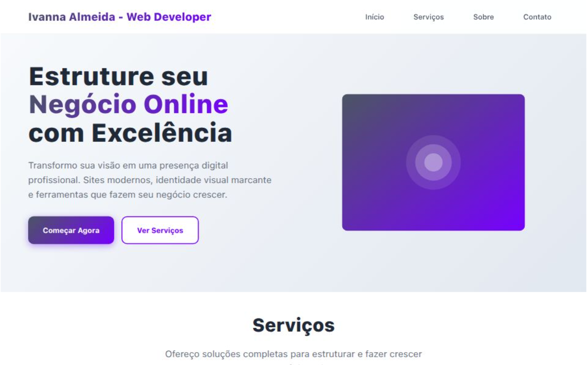

# 🌐 Negócio Online

Um site moderno e responsivo para apresentar meu trabalho como desenvolvedora web freelancer. 
Criado com HTML, CSS e JavaScript puro, o projeto foca na conversão de leads, navegação intuitiva e integração com WhatsApp.

## 👩‍💻 Sobre Mim

Sou Ivanna Almeida, sou uma profissional com sólida experiência em gestão administrativa em empresas de tecnologia, focado em transformar ideias em soluções digitais funcionais, modernas e personalizadas. Especialista em estruturação de negócios online, combinando design moderno, tecnologia avançada e estratégias de marketing digital para criar uma presença digital forte e eficiente.

Minha missão é transformar sua visão de negócio em uma realidade digital que gera resultados, aumenta a credibilidade e facilita o relacionamento com seus clientes.

### Habilidades: 

Assistência administrativa, entrada de dados, desenvolvimento web, web design, HTML, CSS, Javascript, PHP, React, React Native, Node.js, MongoDB, MySQL. 

## 📸 Screenshot



[👉 Clique aqui para visitar a página](https://vercel.app)

## ✨ Funcionalidades

- Menu responsivo com toggle para mobile
- Navegação com rolagem suave (smooth scroll)
- Seções bem definidas: Início, Serviços, Sobre, Contato
- Cards de serviços clicáveis com integração direta ao WhatsApp
- Estilo visual moderno com animações e transições suaves
- Design responsivo para diferentes tamanhos de tela
- Alertas personalizados de envio de mensagem
- Scroll reveal animation (animações ao rolar a página)
- SEO básico com metatags
- Estrutura sem dependências externas além do Google Fonts

## 🛠 Tecnologias Utilizadas

- HTML5 semântico
- CSS3 com Flexbox e Grid
- JavaScript (ES6+)
- Google Fonts (Inter)
- SVGs otimizados e inline
- Boas práticas de acessibilidade e UX

## 📲 Demonstração de Uso

- Acesse a seção de **Serviços** e clique em qualquer card para iniciar uma conversa no WhatsApp.
- Preencha o formulário em **Contato** para simular o envio de uma proposta.
- Navegue por diferentes dispositivos e veja o comportamento responsivo.

## 🧪 Como Testar Localmente

1. Clone este repositório:
   ```bash
   git clone https://github.com/seu-usuario/negocio-online.git
   ```
2. Navegue até o diretório:
   ```bash
   cd negocio-online
   ```
3. Abra o `index.html` em seu navegador.

> Nenhuma instalação adicional é necessária. Não há dependências externas.

## 📌 Melhorias Futuras

- Backend real para submissão de formulários
- CMS leve para gerenciamento de conteúdo (ex: Netlify CMS ou Strapi)
- Dark mode

## 📩 Contato
Se quiser adaptar este projeto para seu negócio, entre em contato comigo por e-mail ou pelas redes sociais:

- ✉️ ivannatech@gmail.com
- 💼 [LinkedIn](https://www.linkedin.com/in/ivanna-almeida/)
- 🖥️ [GitHub](https://github.com/ivannatech)

---

> Este projeto é parte de um portfólio de desenvolvedora web freelancer e está disponível para uso não-comercial ou como base para novos projetos personalizados.
